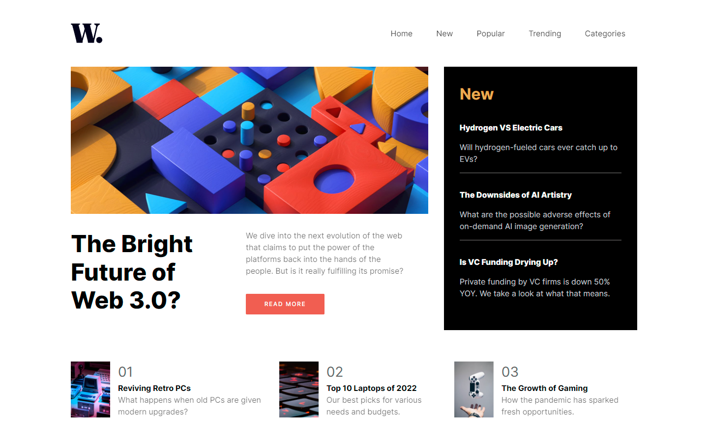
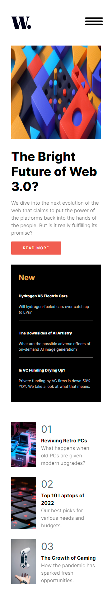

# Frontend Mentor - News homepage solution

This is a solution to the [News homepage challenge on Frontend Mentor](https://www.frontendmentor.io/challenges/news-homepage-H6SWTa1MFl). Frontend Mentor challenges help you improve your coding skills by building realistic projects.

## Table of contents

- [Overview](#overview)
  - [The challenge](#the-challenge)
  - [Screenshot](#screenshot)
  - [Links](#links)
- [My process](#my-process)
  - [Built with](#built-with)
  - [What I learned](#what-i-learned)
- [Author](#author)

## Overview

- This is my 4th frontEndmentor challenge about build simple News Home pages

### The challenge

Users should be able to:

- View the optimal layout for the interface depending on their device's screen size
- See hover and focus states for all interactive elements on the page

### Screenshot

### Links

- Solution URL: [GitHub](https://github.com/Wali1209/news-homepage-main)
- Live Site URL: [GH-Pages](https://wali1209.github.io/news-homepage-main/)

## My process

- Installing Vite as a build tool for the project
- Creating React App + TypeScript with Vite
- Importing all Assests to the project
- Installing styled-components and react-icons from NodePackageManager
- Creating individual components for every Section of the page
- Building Each section completely and moving to the next section
- Add hovering and focus Effect
- Making the page Responsive using Media Queries

### Built with

- Semantic HTML5 markup
- CSS custom properties
- Flexbox
- TypeScript
- [React](https://reactjs.org/) - JS library
- [Styled Components](https://styled-components.com/) - For styles

### What I learned

- React Hooks
- React-Icons

## Author

- Frontend Mentor - [@Wali1209](https://www.frontendmentor.io/profile/Wali1209)
- GitHUB - [@Wali1209](https://github.com/Wali1209)
- Facebook - [Wali Hashmi](https://www.facebook.com/mdwali.hashmi.1/)
- Twitter - [@MWali1209](https://twitter.com/MWali1209)
